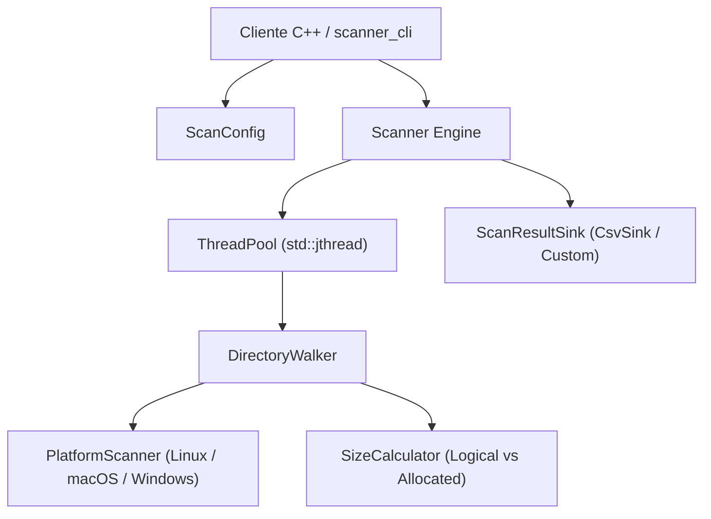

<div align="center">

# ⚡ Scanner.cpp

### *Escáner de Sistemas de Archivos Multi-hilo de Alto Rendimiento en C++20*

[](https://en.cppreference.com/w/cpp/compiler_support/20)
[](https://cmake.org)
[](LICENSE)
[](docs/architecture.md)
[](.github/workflows/ci.yml)

<br />

**[ 📖 Documentación ](docs/getting-started.md)** &nbsp;|&nbsp;
**[ 🚀 Inicio Rápido ](#-quick-start--inicio-rápido)** &nbsp;|&nbsp;
**[ ⚙️ Arquitectura ](docs/architecture.md)** &nbsp;|&nbsp;
**[ 📚 Referencia API ](docs/api.md)** &nbsp;|&nbsp;
**[ 🤝 Contribuir ](CONTRIBUTING.md)** &nbsp;|&nbsp;
**[ 🌐 English Version ](README.en.md)**

---

</div>

## 📌 Descripción General

**Scanner.cpp** es una librería moderna y de ultra-alto rendimiento desarrollada en **C++20** junto con una herramienta CLI interactiva (`scanner_cli`). Diseñada para la navegación recursiva y el análisis de jerarquías masivas de directorios y sistemas de archivos, permite medir el **tamaño lógico** y el **espacio físico asignado en disco**, deduplicar *hard links* y exportar los resultados en tiempo real (*streaming*) sin agotar la memoria RAM.

Utiliza primitivas modernas de C++20 como `std::jthread` y `std::stop_token`, combinadas con llamadas nativas al sistema operativo en Linux (`statx`/`fts`), macOS (`getattrlist`) y Windows (`GetFileInformationByHandleEx`), logrando maximizar la tasa de transferencia en unidades SSD NVMe y arreglos RAID.

---

## ✨ Funcionalidades Principales

| Funcionalidad | Descripción |
| :--- | :--- |
| 🚀 **Concurrencia Escalable** | Pool de hilos (*ThreadPool*) multinúcleo dinámico con distribución de carga thread-safe. |
| ⚡ **Abstracción Nativa POSIX / Win32** | Acceso a bajo nivel optimizado por plataforma (Linux `statx`, macOS `getattrlist`, Windows Win32 API). |
| 📊 **Arquitectura de Sinks en Streaming** | Transmisión continua de resultados (`ScanResultSink` / `CsvSink`) con un impacto de memoria RAM plano constante ($\mathcal{O}(1)$). |
| 🔗 **Deduplicación de Hard Links** | Identificación de inodos únicos mediante parejas `(device, inode)` para prevenir contabilidad doble de espacio asignado. |
| 🎯 **Métricas Duales de Tamaño** | Cálculo diferencial entre el tamaño nominal del archivo y los bloques físicos reales ocupados en disco. |
| 🛑 **Cancelación Cooperativa y Telemetría** | Interrupción limpia mediante `std::stop_token` de C++20 y transmisión de instantáneas de progreso (`ScanProgressSnapshot`). |
| 🛠️ **Filtros Avanzados** | Exclusión automática de sistemas de archivos virtuales (`/proc`, `/sys`), carpetas ocultas, límites de profundidad y filtrado por tamaño de archivo. |

---

## 🏗️ Stack Tecnológico y Plataformas

```text
               ┌─────────────────────────────────────────────────┐
               │                Scanner.cpp API                  │
               └────────────────────────┬────────────────────────┘
                                        │
                 ┌──────────────────────┼──────────────────────┐
                 ▼                      ▼                      ▼
        ┌─────────────────┐    ┌─────────────────┐    ┌─────────────────┐
        │   Linux Engine  │    │  macOS Engine   │    │ Windows Engine  │
        │   (statx / fts) │    │  (getattrlist)  │    │ (FILE_ID_INFO)  │
        └─────────────────┘    └─────────────────┘    └─────────────────┘
```

- **Lenguaje Core**: ISO C++20 (`std::jthread`, `std::stop_token`, `std::filesystem`, `std::variant`, `std::optional`).
- **Sistema de Construcción**: CMake 3.15+ (con soporte para `FetchContent` y exportación de objetivos `scanner::scanner`).
- **Sistemas Operativos**: Linux (kernels 4.x+), macOS 10.15+ (Intel & Apple Silicon), Windows 10/11/Server.
- **Formato de Exportación Integrado**: CSV streaming thread-safe (`CsvSink`).

---

## 🗺️ Índice Navegable

- [📌 Descripción General](#-descripción-general)
- [✨ Funcionalidades Principales](#-funcionalidades-principales)
- [🏗️ Stack Tecnológico](#-stack-tecnológico-y-plataformas)
- [🚀 Quick Start / Inicio Rápido](#-quick-start--inicio-rápido)
  - [Compilando en 60 Segundos](#1-compilando-el-proyecto-en-60-segundos)
  - [Uso por Línea de Comandos (CLI)](#2-uso-mediante-la-cli-scanner_cli)
  - [Uso desde Código C++20](#3-uso-desde-código-c20)
- [📦 Integración en Proyectos CMake](#-integración-en-proyectos-cmake)
- [🧭 Arquitectura del Motor](#-arquitectura-del-motor)
- [⚙️ Configuración y Opciones](#️-configuración-y-opciones)
- [🧪 Pruebas y Benchmarking](#-pruebas-y-benchmarking)
- [📚 Guías y Documentación Relacionada](#-guías-y-documentación-relacionada)
- [🤝 Contribución y Comunidad](#-contribución-y-comunidad)
- [📜 Licencia](#-licencia)

---

## 🚀 Quick Start / Inicio Rápido

### 1. Compilando el proyecto en 60 segundos

```bash
# 1. Clonar el repositorio
git clone https://github.com/Bode512/Scanner-cpp.git
cd Scanner-cpp

# 2. Configurar y compilar la librería, CLI, tests y benchmarks
cmake -S . -B build -DCMAKE_BUILD_TYPE=Release
cmake --build build --parallel

# 3. Validar con la suite de pruebas unitarias
ctest --test-dir build --output-on-failure
```

---

### 2. Uso mediante la CLI (`scanner_cli`)

Escanea cualquier directorio y exporta el informe de archivos y carpetas a un archivo CSV:

```bash
# Escanear el directorio /var/log con 8 hilos de procesamiento
./build/scanner_cli /tmp/var_log_scan.csv /var/log --workers 8
```

#### Ejemplos adicionales de uso CLI:

```bash
# Filtrar solo archivos iguales o superiores a 50 MB (52428800 bytes)
./build/scanner_cli /tmp/large_files.csv /home/usuario --min-size 52428800

# Escanear sin emitir archivos individuales (solo informe de directorios)
./build/scanner_cli /tmp/dirs_summary.csv /home/usuario --no-files

# Abortar automáticamente tras 15 segundos
./build/scanner_cli /tmp/scan.csv /home/usuario --timeout 15
```

---

### 3. Uso desde Código C++20

#### Ejemplo mínimo de escaneo directo:

```cpp
#include "scanner/scanner.hpp"
#include "integration/csv_sink.hpp"
#include <iostream>

using namespace scanner;

int main() {
    // Configuración del motor
    ScanConfig config;
    config.included_paths.push_back("/home/usuario/Documents");
    config.worker_count = std::thread::hardware_concurrency();
    config.emit_files = true;
    config.emit_directories = true;

    // Sink de salida a CSV
    CsvSink sink("documents_report.csv");

    // Ejecución del escáner
    Scanner scanner_engine(config);
    scanner_engine.scan(sink);

    std::cout << "Escaneo completado exitosamente.\n";
    return 0;
}
```

#### Ejemplo con callback de progreso en tiempo real:

```cpp
#include "scanner/scanner.hpp"
#include "integration/csv_sink.hpp"
#include <iostream>

using namespace scanner;

int main() {
    ScanConfig config;
    config.included_paths.push_back("/home/usuario");
    config.progress_interval_ms = 250; // Notificación cada 250ms

    CsvSink sink("/tmp/home_scan.csv");
    Scanner scanner_engine(config);

    auto progress_cb = [](const ScanProgressSnapshot& snap) {
        std::cerr << "\r[PROGRESO] Archivos: " << snap.files_visited
                  << " | Carpetas: " << snap.directories_visited
                  << " | Bytes: " << snap.bytes_processed
                  << " | Errores: " << snap.errors << std::flush;
    };

    scanner_engine.scan(sink, progress_cb);
    std::cerr << "\nEscaneo finalizado.\n";
    return 0;
}
```

---

## 📦 Integración en Proyectos CMake

Puedes incorporar **Scanner.cpp** directamente en tu proyecto usando `FetchContent` en tu archivo `CMakeLists.txt`:

```cmake
cmake_minimum_required(VERSION 3.15)
project(mi_aplicacion CXX)

set(CMAKE_CXX_STANDARD 20)

include(FetchContent)
FetchContent_Declare(
    scanner
    GIT_REPOSITORY https://github.com/Bode512/Scanner-cpp.git
    GIT_TAG        main
)
FetchContent_MakeAvailable(scanner)

add_executable(mi_app main.cpp)
target_link_libraries(mi_app PRIVATE scanner::scanner)
```

---

## 🧭 Arquitectura del Motor

El motor separa limpiamente las responsabilidades entre la navegación de directorios, la concurrencia, las llamadas a la plataforma y la salida de datos:



Para una explicación detallada de los diagramas de secuencia, deduplicación de hard links y gestión de colas de trabajo, consulta la **[Guía de Arquitectura Complete](docs/architecture.md)**.

---

## ⚙️ Configuración y Opciones

El objeto `ScanConfig` permite un control preciso del comportamiento de navegación:

| Campo | Defecto | Descripción |
| :--- | :---: | :--- |
| `included_paths` | `[]` | Lista de rutas absolutas específicas a explorar. |
| `worker_count` | `hardware_concurrency` | Número de hilos de trabajo paralelos. |
| `follow_symlinks` | `false` | Indica si se deben seguir enlaces simbólicos. |
| `include_hidden` | `false` | Incluye archivos y directorios ocultos. |
| `count_hardlinks_once`| `true` | Evita duplicar el espacio físico de inodos vinculados. |
| `min_file_size` | `0` | Filtro de tamaño mínimo en bytes. |
| `progress_interval_ms`| `500` | Intervalo en ms para notificar al callback de progreso. |

Consulta la **[Guía de Configuración](docs/configuration.md)** para una referencia exhaustiva.

---

## 🧪 Pruebas y Benchmarking

### Suite de Pruebas Unitarias

El proyecto incluye pruebas unitarias integradas con CTest:

```bash
# Compilar y ejecutar pruebas unitarias
cmake --build build --target test_scanner
ctest --test-dir build --output-on-failure
```

### Benchmarks de Rendimiento

Para ejecutar las pruebas intensivas de carga y rendimiento de E/S:

```bash
./build/benchmark /home/usuario /tmp/benchmark_results.csv
```

---

## 📚 Guías y Documentación Relacionada

- 🚀 **[Guía de Inicio Rápido](docs/getting-started.md)**
- 🧭 **[Arquitectura y Diseño](docs/architecture.md)**
- 📚 **[Referencia de la API C++20](docs/api.md)**
- ⚙️ **[Opciones de Configuración](docs/configuration.md)**
- 📖 **[Manual de Uso Completo](docs/usage.md)**
- 🔨 **[Guía de Compilación e Instalación](docs/build.md)**
- 🛠️ **[Solución de Problemas (Troubleshooting)](docs/troubleshooting.md)**
- 💬 **[Preguntas Frecuentes (FAQ)](docs/faq.md)**
- 🗺️ **[Roadmap del Proyecto](ROADMAP.md)**

---

## 🤝 Contribución y Comunidad

¡Las contribuciones son bienvenidas! Si deseas aportar correcciones de errores, optimizaciones de rendimiento o nuevas funcionalidades, consulta nuestra **[Guía de Contribución](CONTRIBUTING.md)**.

Asegúrate de revisar también nuestro **[Código de Conducta](CODE_OF_CONDUCT.md)** y la **[Política de Seguridad](SECURITY.md)**.

---

## 📜 Licencia

Este proyecto está distribuido bajo los términos de la **[Licencia Apache 2.0](LICENSE)**.

```text
Copyright 2026 Scanner.cpp Contributors

Licensed under the Apache License, Version 2.0 (the "License");
you may not use this file except in compliance with the License.
You may obtain a copy of the License at

    http://www.apache.org/licenses/LICENSE-2.0
```
