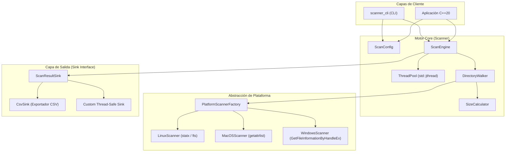
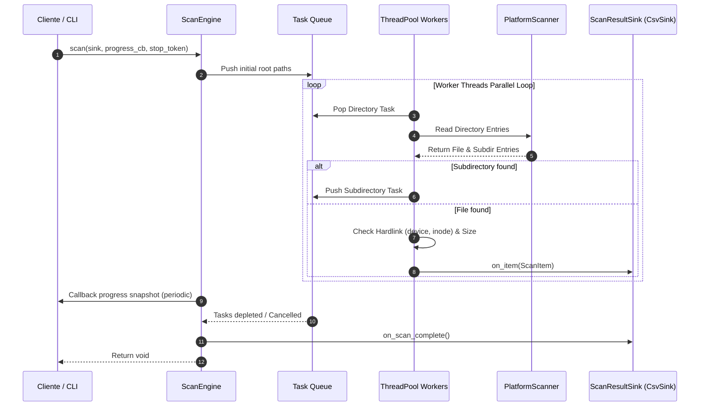
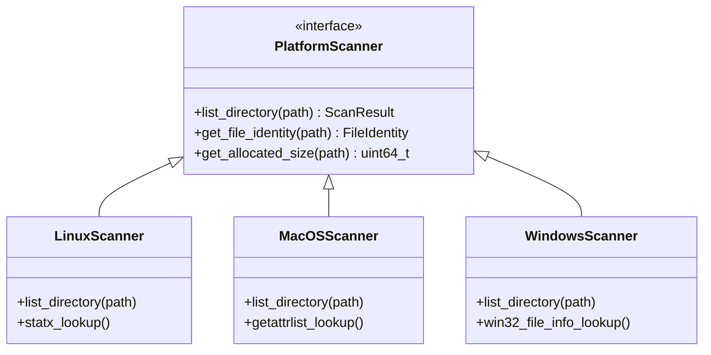

# 🧭 Arquitectura del Sistema — Scanner.cpp

Este documento detalla el diseño arquitectónico, el flujo de datos multi-hilo, la abstracción multiplataforma y las decisiones de diseño fundamentales de **Scanner.cpp**.

---

## 📐 Visión General de la Arquitectura

**Scanner.cpp** está diseñado bajo los principios de **alta concurrencia**, **cero consumo de memoria innecesario (*streaming architecture*)** y **desacoplamiento modular**.

El motor separa la navegación de directorios, la captura de metadatos de archivos del sistema operativo, el control de concurrencia y la emisión de resultados mediante un patrón de **Publisher-Subscriber (Sink)**.

---

## 🧵 Flujo Multi-hilo y Pipeline de Procesamiento

El procesamiento de directorios sigue un modelo de **distribución dinámica de tareas por colas de trabajo thread-safe**:

1. **Inicialización**: Se inicializa la cola de trabajo (*Task Queue*) con las rutas contenidas en `ScanConfig::included_paths`.
2. **Procesamiento de Workers**: Cada worker extrae un directorio de la cola, invoca el lector de plataforma (`DirectoryWalker`) y enumera sus entradas.
3. **Filtro y Encolado**:
   - Los subdirectorios descubiertos se filtran (profundidad, ocultos, excluded fs) y se re-encolan para procesamiento paralelo.
   - Los archivos se procesan mediante `SizeCalculator` para obtener su tamaño lógico y asignado en disco (bloques del filesystem).
4. **Emisión de Resultados**: Los datos procesados (`ScanItem`) se envían de forma thread-safe al `ScanResultSink`.
5. **Progreso y Cancelación**: Cada $N$ ms, la instantánea de progreso (`ScanProgressSnapshot`) notifica al callback registrado. El token de cancelación `std::stop_token` permite interrumpir todos los trabajadores cooperativamente.

---

## 🔀 Capa de Abstracción de Plataforma

Dado que los sistemas de archivos difieren entre sistemas operativos (POSIX vs Windows NT), el proyecto implementa el patrón **Factory Method**:

- **Linux (`linux_scanner.cpp`)**: Utiliza syscalls avanzadas POSIX y `statx` (en kernels compatibles) para recuperar bloques de inodos asignados (`stx_blocks`), deduplicando hard links via `(stx_dev_major/minor, stx_ino)`.
- **macOS (`macos_scanner.cpp`)**: Utiliza `getattrlist` y `fts(3)` optimizado para sistemas HFS+ / APFS.
- **Windows (`windows_scanner.cpp`)**: Utiliza la API de Win32 `GetFileInformationByHandleEx` con la estructura `FILE_ID_INFO` para obtener el identificador único de archivo de 128-bits en NTFS/ReFS.

---

## 💾 Deduplicación de Hard Links

Para evitar la contabilidad doble de espacio en disco causada por múltiples *hard links* señalando al mismo inodo físico:

$$\text{Identity Key} = (\text{Device ID}, \text{Inode Number})$$

Cuando `ScanConfig::count_hardlinks_once = true`, el motor mantiene una tabla hash concurrente o de lock limitado con los identidades `(device, inode)` ya procesados. Si un archivo posee `hardlink_count > 1` y su identidad ya ha sido registrada, el tamaño físico asignado solo se contabiliza una vez.

---

## 📊 Medición de Tamaños: Lógico vs Asignado

- **Tamaño Lógico (`logical_size`)**: La longitud nominal en bytes del archivo (`st_size` en POSIX / `nFileSizeLow/High` en Win32).
- **Tamaño Asignado (`allocated_size`)**: El espacio real reservado en los bloques del disco por el sistema de archivos (ej. sectores de 4096 bytes, archivos sparse o comprimidos).
